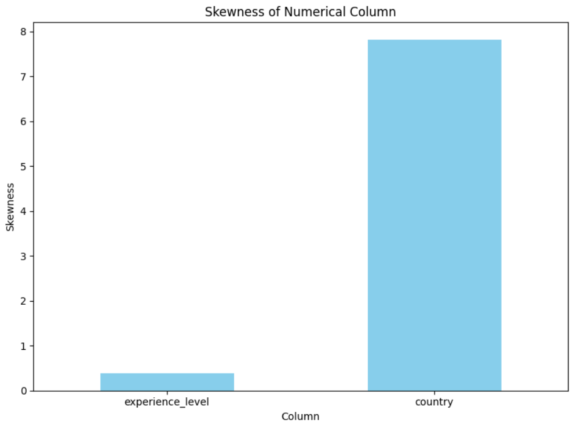
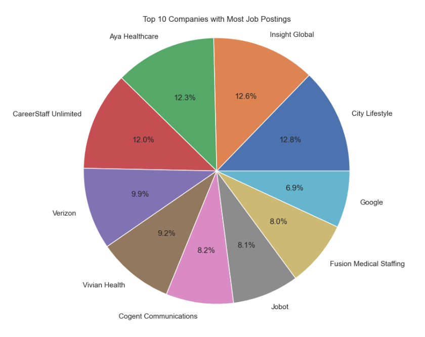

# LinkedIn-Job-Analysis-Data-Preprocessing-Visualization

## Overview

This project is developed as part of the "Pre-processing and Visualising Data" course (First Semester of Master's) at the University of Prishtina (UP), Faculty of Electrical and Computer Engineering (FIEK).

The "LinkedIn Job Postings" dataset is sourced from Kaggle, [LinkedIn Job Postings - 2023](https://www.kaggle.com/datasets/arshkon/linkedin-job-postings/data), and contains information related to job postings, companies, skills, and more from LinkedIn's platform.

## Objectives

The primary objective of this data preprocessing assignment is to prepare the "LinkedIn Job Postings" dataset for subsequent analysis. The processed dataset will be utilized to visualize:

1. **Top 10 Companies with the Most LinkedIn Job Postings by cities**

   - Identifying and displaying the companies that have the highest number of job postings on LinkedIn.

2. **Top Skills Required by most Companies**

   - Analyzing and visualizing the most sought-after skills as specified in the job postings by various companies.

## Dataset Files

The dataset comprises several CSV files:

- **job_postings.csv:** Contains job-related information like job ID, company ID, title, description, salary details, location, skills required, etc.
- **companies.csv:** Includes details about companies such as ID, name, description, size, location, etc.
- **job_skills.csv:** Presents a mapping of job IDs to skill abbreviations.
- **skills.csv:** Features a mapping of skill abbreviations to skill names.

### _Dataset Size_

The CSV files mentioned above have the following unique rows:

_job_postings:_ _33246_ _rows_,  
_job_skills_: _32422 \_rows_,\_  
_companies:_ _11361 \_rows_,\_  
_skills:_ \_35 \_rows\_\_

## Unused Tables

There are additional tables present in the dataset that were not utilized for this particular analysis, including benefits, job industries, salaries, company industries, company specialties, and employee count.

## Data Quality

The dataset's quality was assessed, and some data preprocessing was necessary before use. Some processing encountered included:

- Missing values in certain columns (e.g., experience levels, company names etc).
- Inconsistent formatting across fields like company details (e.g name and location).
- Duplicates or inconsistencies in job IDs.

## Attribute Types

The dataset contains various types of attributes, such as:

- **Numeric:** Salary-related fields (max_salary, med_salary, min_salary), views, zip codes, etc.
- **Categorical**: job titles, currencies, experience levels, etc.
- **Textual**: Job descriptions, company descriptions, skill names, etc.
- **Boolean**: Remote_allowed, sponsored,etc.

## Steps Taken for Data Preprocessing:

To achieve the above objectives, the following steps were undertaken during the data preprocessing phase:

- Data Cleaning:
  - Handling missing values, correcting inconsistencies, and ensuring data uniformity for accurate analysis.
- Feature Extraction:
  - Extracting and organizing relevant features such as company names and required skills.
- Aggregation:
  - Aggregating data to derive meaningful insights, such as grouping job_id's by skills.
- Integration:
  - Merging or integrating multiple datasets to create a unified and comprehensive dataset for analysis.
- Dimensionality Reduction:
  - Reducing the number of features or variables in the dataset to mitigate the curse of dimensionality, improve model efficiency, and avoid overfitting.
- Categorization:
  - Assigning categorical labels or grouping values for better representation or analysis.

## Expected Outcome

Upon successful preprocessing of the "LinkedIn Job Postings" dataset, the following visualizations will be created:

- A graphic representation showcasing the top 10 companies with the highest number of job postings by cities on LinkedIn .
- A graphic representation depicting the most in-demand skills sought after by these companies in their job postings.

## Project Setup

To use the code, take the following steps:

1. Install Jupyter Extensions in VS Code:  
   Open VS Code and navigate to the Extensions view. Search for "Jupyter" and install the "Jupyter" extension provided by Microsoft.
2. Install Libraries:  
   Pandas is a crucial library for data analysis in Python. You can install libraries via the terminal or command prompt using pip.  
   Use the command:
   ```
   pip install pandas
   pip install pandas
   pip install seaborn
   pip install matplotlib
   pip install scipy
   pip install sklearn
   pip install imbalanced-learn
   pip install plotly.express
   pip install matplotlib.pyplot
   pip install ipywidgets
   pip install IPython.display
   ```
3. To run the code, you'll open the file in Jupyter Notebook and execute the cells containing the code.

Here's a simple guide to running an .ipynb file:

1. Navigate to the '.ipynb' file
2. Kernel Selection:  
   Ensure that the correct kernel corresponding to the programming language you're using is selected. For Python, the Python kernel should be active.
3. Execute Code Cells:  
   Once the notebook is open, you can run the code cells individually or all at once. Click on a cell containing code and use the "Run" button in the toolbar, or use Shift+Enter as a shortcut to execute the cell. The results (Output) will display directly below the cell.

<hr>

# Second phase

The second phase of the project in preprocessing and data visualization involves several important aspects:

1. Detection and removal of outliers.
2. Mitigation of inaccurate detections.
3. Data exploration: summary statistics, multivariate analysis.
4. SMOTE analysis.
5. Addressing data skewness.
6. Creating training and testing datasets.

## Detecting and removing of outliers

### Z-score technique

In our project, we utilized the Z-score method for outlier detection on the 'experience_level' and 'country' columns within our dataset. We employed the stats.zscore function from the NumPy library to compute the Z-scores for each value in these columns. This calculation enabled us to assess the deviation of each value from its respective column mean in terms of standard deviations. To flag potential outliers, we set a threshold of 3.

By generating a scatter plot that represents these two columns, we visually pinpointed outliers identified by their Z-scores. These outliers were highlighted in red, overlaid on the original scatter plot (displayed in blue). This visualization allowed us to easily discern their positions in relation to the rest of the dataset.

### Identifying outliers based on frequency

We've created a method named 'detect_outliers_frequency' intended for outlier identification based on frequency within our dataset. This function accepts data as input alongside lower and upper bounds, set by default to 700 and 30,000 respectively. Consequently, it aids in filtering values whose frequency is below the lower bound or surpasses the upper limit.

We've identified outliers using the z-score technique, flagging any data points lying beyond the 3% threshold.

#### IQR method

Another method used for outlier detection is the IQR method, which involves calculating quartiles (q1 and q3), determining the interquartile range (IQR), and establishing upper and lower bounds to detect outliers in a dataset.

<div style="display: flex; justify-content: center; align-items: center; flex-direction: column;">
  <figure style="text-align: center;">
    
    <figcaption style="color: lightblue; font-style: italic; text-align: center;">Fig. 1. Distribution of dataset before & after removing outliers</figcaption>
  </figure>
</div>

## Detecting and removing of anomalies

We've developed methods called 'generate_valid_countries' and 'remove_country_anomalies' to aid in identifying and eliminating anomalies within a 'country' column. The 'generate_valid_countries' function dynamically generates a list of valid countries based on a length criterion (countries with a length of 2 characters). We showed histograms before and after the anomaly removal process to visualize the frequency distribution of countries.

## SMOTE algorithm

SMOTE is dedicated to rectifying class imbalances by showcasing the transformation of class distribution from an imbalanced state to a more balanced one. This process is pivotal in enhancing machine learning model performance, particularly when handling imbalanced classes, thereby improving their effectiveness.

1. Visualizing Class Distribution Before SMOTE:
   - Creates a bar plot showcasing the distribution of 'experience_level' within the sample dataset before applying SMOTE.
2. SMOTE Application:
   - Uses SMOTE to oversample the minority class ('experience_level') in the training set, creating a more balanced dataset.

<div style="display: flex; justify-content: center; align-items: center; flex-direction: column;">
  <figure style="text-align: center;">
    
    <figcaption style="color: lightblue; font-style: italic; text-align: center;">Fig. 2. Class distribution before and after SMOTE</figcaption>
  </figure>
</div>

## Comparative Distribution Analysis: Original Dataset vs. Sampled Subset

We used the code to conducts random sampling from a dataset, creating a smaller representative sample to visualize and compare the distribution of two different columns, 'experience_level' and 'country'.

Here's a step-by-step explanation:

1. Random Sampling:
   - Sets a sample size of 20 and randomly selects rows from the 'cleaned_data' dataset using the sample method.
2. Histogram Comparison - 'experience_level' and 'country' Column:
   - Left subplot (Original Dataset): Plots a histogram of the 'experience_level' column from the entire dataset ('cleaned_data') in blue.
   - Right subplot (Sampled Dataset): Plots a histogram of the 'experience_level' column from the sampled data in orange.

<div style="display: flex; justify-content: center; align-items: center; flex-direction: column;">
  <figure style="text-align: center;">
    
    <figcaption style="color: lightblue; font-style: italic; text-align: center;">Fig. 3. Original Dataset vs Sampled Subset</figcaption>
  </figure>
</div>

## Skewness data

Skewness is a statistical measure that indicates the asymmetry or deviation from symmetry in a dataset's distribution. We have selected numerical columns 'experience_level' and 'country' from the dataset.
skew() function is used to compute the skewness values for the specified numerical columns within the 'cleaned_data' and 'cleaned_df' dataset after and before removing outliers.

Upon examination of the outcomes, we observe that the 'experience_level' column exhibits a symmetric distribution. Conversely, the 'country' column displays positive skewness.

<div style="display: flex; justify-content: center; align-items: center; flex-direction: column;">
  <figure style="text-align: center;">
    
    <figcaption style="color: lightblue; font-style: italic; text-align: center;">Fig. 4. Skewness of experience_level and country</figcaption>
  </figure>
</div>

## Separate the dataset into training and testing data

This phase involves splitting the data into training and testing sets.

Experience Level Analysis:

1. Utilizes a dataset ('cleaned_data') with an assumed 'experience_level' column.
2. Splits the data into features (X) and the target variable 'experience_level' (y).
3. Divides the dataset into 80% training and 20% testing subsets using 'train_test_split'.
4. Visualizes the distribution of 'experience_level' within both the training and testing sets using histograms.

This phase encompasses similar procedures applied to the 'country' column.

The accuracy achieved by employing Logistic Regression Modeling stands at 83%.

We have generated a matrix summarizing the model's classifications, comparing predicted and actual labels.This visualization provides a comprehensive overview of how well the model's predictions align with the actual class labels, showcasing true positives, true negatives, false positives, and false negatives across different classes in a classification task.

## Statistical Measures

We have calculated statistical measures for 'experience_level' and 'country' column:

Mean:</br>
experience_level 4.174902,</br>
country 1.000000

Mode:</br>
experience_level 4,</br>
country 1

Standard Deviation:</br>
experience_level 1.889867,</br>
country 0.000000

Median:</br>
experience_level 4.0,</br>
country 1.0

Variance:</br>
experience_level 3.571599,</br>
country 0.000000

Summary Statistics for 'experience_level' column:

min 1.000000 </br>
25% 2.000000</br>
50% 4.000000</br>
75% 7.000000</br>
max 7.000000</br>

Summary Statistics for 'country' column:

min 1.0</br>
25% 1.0</br>
50% 1.0</br>
75% 1.0</br>
max 1.0</br>

<div style="display: flex; justify-content: center; align-items: center; flex-direction: column;">
  <figure style="text-align: center;">
    
    <figcaption style="color: lightblue; font-style: italic; text-align: center;">Fig. 5. Histogram of Mean, Median and Mode</figcaption>
  </figure>
</div>

# Visualization

### Visualization of data based on data type.

#### Our dataset contains nominal data types (company, location) and ordinal data types (experience_level).

1.  Top 10 companies that have posted the most jobs requiring 'Engineering' or 'Information Technology' skills

#### Nominal data type

<div style="display: flex; justify-content: center; align-items: center; flex-direction: column;">
  <figure style="text-align: center;">
    
    <figcaption style="color: lightblue; font-style: italic; text-align: center;">Fig. 6. Top 10 companies that have posted the most jobs requiring 'Engineering' or 'Information Technology' skills</figcaption>
  </figure>
</div>
</br>
2. Displaying the distribution of job postings among the top 10 companies for the selected experience level

#### Ordinal and nominal type of data

<div style="display: flex; justify-content: center; align-items: center; flex-direction: column;">
  <figure style="text-align: center;">
    
    <figcaption style="color: lightblue; font-style: italic; text-align: center;">Fig. 7. Displaying the distribution of job postings among the top 10 companies for the selected experience level</figcaption>
  </figure>
</div>

### Static Visualization

#### In this part, we will visualise the static representation of the data in our dataset

1. Pie Chart showing top 10 companies with Most Job Postings in Linkedin

<div style="display: flex; justify-content: center; align-items: center; flex-direction: column;">
  <figure style="text-align: center;">
    
    <figcaption style="color: lightblue; font-style: italic; text-align: center;">Fig. 8. Pie Chart showing top 10 companies with Most Job Postings in Linkedin</figcaption>
  </figure>
</div>
</br>

2. Donut chart showing top 10 locations with Most Job Postings in Linkedin

<div style="display: flex; justify-content: center; align-items: center; flex-direction: column;">
  <figure style="text-align: center;">
    
    </br>
    <figcaption style="color: lightblue; font-style: italic; text-align: center;">Fig. 9. Donut chart showing top 10 locations with Most Job Postings in Linkedin</figcaption>
  </figure>
</div>

### Interactive Visualization

#### In this part, we will visualise the interactive representation of the data in our dataset

#### The first graph will display the top 10 most required skills based on the top 10 locations with the highest number of job postings on LinkedIn, and it's also possible to filter based on experience level.

1. Skills distribution based on location and experience level

<div style="display: flex; justify-content: center; align-items: center; flex-direction: column;">
  <figure style="text-align: center;">
    
    <figcaption style="color: lightblue; font-style: italic; text-align: center;">Fig. 10. Pie chart showing top skills based on location and experience level</figcaption>
  </figure>
</div>
</br>

1. Top companies based on location and experience level

<div style="display: flex; justify-content: center; align-items: center; flex-direction: column;">
  <figure style="text-align: center;">
    
    <figcaption style="color: lightblue; font-style: italic; text-align: center;">Fig. 11. Pie chart showing top companies based on location and experience level</figcaption>
  </figure>
</div>

### Multi-dimensional Visualization

#### Relationships among the top 5 companies, locations, and skills are explored by creating an interactive 3D scatter plot visualization.

<div style="display: flex; justify-content: center; align-items: center; flex-direction: column;">
  <figure style="text-align: center;">
    
    <figcaption style="color: lightblue; font-style: italic; text-align: center;">Fig. 12. 3D visualisation of Top 5 companies, location and skills</figcaption>
  </figure>
</div>

# Conclusion

#### End of our LinkedIn Job Postings project! 🎉

This repository encapsulates our journey through the comprehensive exploration and visualization of LinkedIn job postings data. Spanning three distinct phases: preprocessing the dataset, removing outliers/anomalies, and visualizing the results.

## Key Objectives Achieved:

1. Identifying Top Companies by Cities:

   We successfully showcased the companies with the highest number of job postings on LinkedIn across various cities.

2. Analyzing Top Skills Required:

   Through meticulous analysis, we visualized the most sought-after skills specified in job postings by different companies.

## Beyond Our Objectives:

Our exploration went beyond the initial goals, allowing us to dive deeper into intricate relationships between companies, locations, and skills. Notably, our interactive 3D scatter plot visualization unveiled compelling connections among the top companies, locations, and skills. Additionally, we delved into company presence based on location and experience level, skill distributions, and presented insights through engaging visualizations like donut and pie charts.
